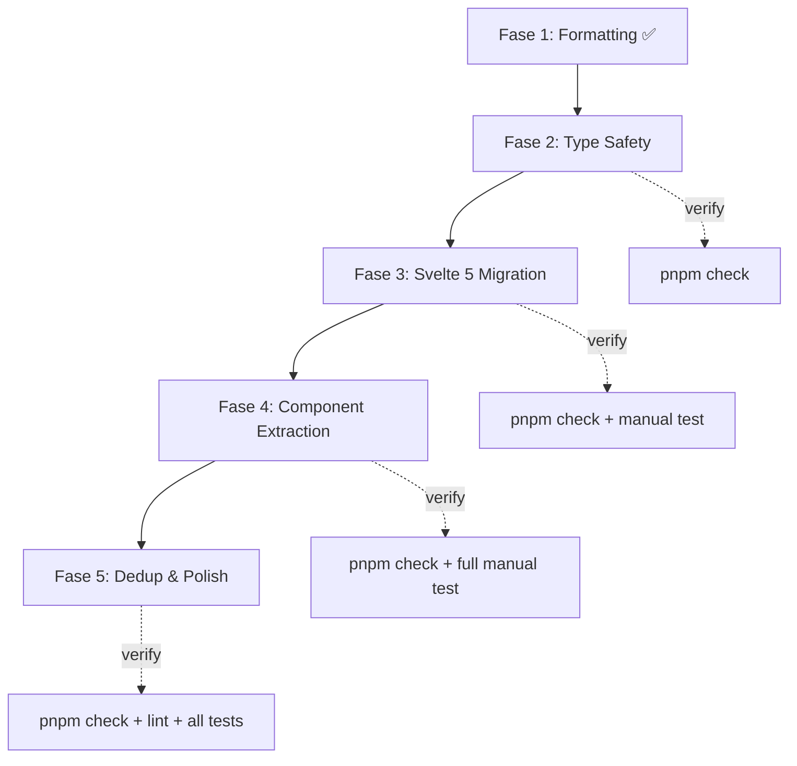

# 🔬 ZatiarasPOS — Plan Detail Menuju 101% Done

> Audit menyeluruh: **78 source files**, **~600KB kode**, commit `3b620bf`

---

## Status Sekarang (Setelah Audit)

| Metrik                   | Angka                                     | Status |
| ------------------------ | ----------------------------------------- | ------ |
| Total files di `src/`    | 78                                        | —      |
| `$state()` (Svelte 5)    | **7** uses (hanya di 1 file)              | 🔴     |
| `$derived()`             | **0** uses                                | 🔴     |
| `$effect()`              | **0** uses                                | 🔴     |
| `$:` (Svelte 4)          | **50+** uses di 7 files                   | 🔴     |
| `writable()` stores      | **4** stores                              | 🔴     |
| `.subscribe()` calls     | **23** calls di routes                    | 🔴     |
| `any` type usage         | **270+** instances                        | 🔴     |
| `(window as any)` hacks  | **30** instances di 8 files               | 🔴     |
| Touch handler duplicates | **3** full copies (dashboard, pos, catat) | 🟡     |
| Prettier violations      | ~~425 files~~ → **0** (FIXED ✅)          | ✅     |
| `svelte-check` errors    | 0                                         | ✅     |

---

## Fase 1: Formatting & Dead Code Cleanup ✅ DONE

- [x] **1.1** Run `npx prettier --write` pada seluruh `src/` — 55 files formatted
- [ ] **1.2** Hapus commented-out code di [laporan/+page.svelte](file:///d:/kulyeah/project/zatiaraspos/src/routes/laporan/+page.svelte)
  - LoC 614: `// $: summary = memoizedSummary(...)`
  - LoC 617-631: Disabled watcher `showFilter`
  - LoC 709-750: Disabled watchers `harian/mingguan/bulanan/tahunan`
  - **Total: ~130 baris dead code**

---

## Fase 2: Type Safety — Hapus Semua `any` (13 tasks)

### 2.1 Perbaiki Duplikasi Interface

| Interface              | Didefinisikan di                           | Aksi                                                                 |
| ---------------------- | ------------------------------------------ | -------------------------------------------------------------------- |
| `ApiResponse<T>`       | `index.ts`, `product.ts`, `transaction.ts` | Hapus dari `product.ts` dan `transaction.ts`, import dari `index.ts` |
| `PaginatedResponse<T>` | `index.ts`, `product.ts`, `transaction.ts` | Hapus dari `product.ts` dan `transaction.ts`, import dari `index.ts` |

#### Step-by-step:

- [ ] **2.1a** [types/product.ts](file:///d:/kulyeah/project/zatiaraspos/src/lib/types/product.ts) — Hapus `ApiResponse<T>` (LoC 122-127) dan `PaginatedResponse<T>` (LoC 129-135), tambahkan `import { ApiResponse, PaginatedResponse } from './index'`
- [ ] **2.1b** [types/transaction.ts](file:///d:/kulyeah/project/zatiaraspos/src/lib/types/transaction.ts) — Hapus `ApiResponse<T>` (LoC 317-322) dan `PaginatedResponse<T>` (LoC 324-330), tambahkan import dari `./index`

### 2.2 Perbaiki `AppState` di `types/index.ts`

- [ ] **2.2** [types/index.ts](file:///d:/kulyeah/project/zatiaraspos/src/lib/types/index.ts#L104) LoC 104-111 — Ganti semua `any` dengan interface yang sudah ada:
  ```ts
  // BEFORE:
  auth: any;
  user: any;
  products: any;
  transactions: any;
  financial: any;
  // AFTER:
  auth: AuthState;
  user: UserState;
  products: ProductState;
  transactions: TransactionState;
  financial: FinancialState;
  ```

### 2.3 Buat Tipe Baru yang Hilang

- [ ] **2.3a** Buat [types/laporan.ts](file:///d:/kulyeah/project/zatiaraspos/src/lib/types/laporan.ts) `[NEW]`
  - `BukuKasRecord` — mapping langsung dari tabel Supabase `buku_kas`
  - `LaporanSummary` — untuk object `summary` di laporan
  - `ReceiptSettings` — untuk `pengaturanStruk`
- [ ] **2.3b** Buat [types/store.ts](file:///d:/kulyeah/project/zatiaraspos/src/lib/types/store.ts) `[NEW]`
  - `BranchId` — union type `'samarinda' | 'berau' | 'Balikpapan' | 'samarinda2' | 'balikpapan2'`
  - `TokoSession` — untuk `sesiAktif` yang di-copy-paste di 3 file

### 2.4 Ganti `any` di Setiap Route File

Setiap file di bawah ini harus di-update untuk menggunakan interface yang sudah didefinisikan:

- [ ] **2.4a** [pos/+page.svelte](file:///d:/kulyeah/project/zatiaraspos/src/routes/pos/+page.svelte) — 40+ `any` → ganti dengan `Product`, `Category`, `AddOn`, `CartItem`
  - `let cart: Array<any>` (LoC 292) → `let cart: CartItem[]`
  - `(item: any) =>` di seluruh file → gunakan tipe yang sesuai
  - `(c as any).id` (LoC 747, 751) → cast ke `Category`
- [ ] **2.4b** [pos/bayar/+page.svelte](file:///d:/kulyeah/project/zatiaraspos/src/routes/pos/bayar/+page.svelte) — 35+ `any`
  - `let cart: any[]` (LoC 22) → `CartItem[]`
  - `let pengaturanStruk: any` (LoC 61) → `ReceiptSettings | null`
  - `let sesiAktif: any` (LoC 89) → `TokoSession | null`
  - `(sum: any, item: any)` di kalkulasi → proper types
- [ ] **2.4c** [laporan/+page.svelte](file:///d:/kulyeah/project/zatiaraspos/src/routes/laporan/+page.svelte) — 80+ `any`
  - `let Wallet: any, ArrowDownCircle: any, ...` (LoC 24) → `typeof import('lucide-svelte/icons/wallet').default | null`
  - `let laporan: any[]` (LoC 521) → `BukuKasRecord[]`
  - `(t: any) => t.tipe === 'in'` (50+ instances) → `(t: BukuKasRecord) =>`
  - `let userProfileData: any` (LoC 30) → proper type
- [ ] **2.4d** [+page.svelte (dashboard)](file:///d:/kulyeah/project/zatiaraspos/src/routes/+page.svelte) — 15+ `any`
  - `let Wallet: any, ShoppingBag: any, ...` (LoC 50) → lazy icon type
  - `applyDashboardData(data: any)` (LoC 256) → proper dashboard type
- [ ] **2.4e** [catat/+page.svelte](file:///d:/kulyeah/project/zatiaraspos/src/routes/catat/+page.svelte) — scan & fix `any`
- [ ] **2.4f** [pengaturan/riwayat/+page.svelte](file:///d:/kulyeah/project/zatiaraspos/src/routes/pengaturan/riwayat/+page.svelte)
  - `let pengaturanStruk: any = $state(null)` (LoC 19) → `ReceiptSettings | null`
  - `let transaksiHariIni: any[]` (LoC 20) → `BukuKasRecord[]`
  - `let selectedTransaksi: any` (LoC 25) → proper type
- [ ] **2.4g** [pengaturan/pemilik/manajemenmenu/+page.svelte](file:///d:/kulyeah/project/zatiaraspos/src/routes/pengaturan/pemilik/manajemenmenu/+page.svelte) — scan & fix `any`
- [ ] **2.4h** [tests/code-quality-tests.ts](file:///d:/kulyeah/project/zatiaraspos/src/tests/code-quality-tests.ts) — 13 `any` → `unknown` atau proper error types

---

## Fase 3: Svelte 5 Migration (11 tasks)

### 3.1 Migrasi Stores ke Runes (4 tasks)

Setiap store harus diubah dari `writable()` ke Svelte 5 `$state()` dengan `.svelte.ts` extension.

- [ ] **3.1a** [userRole.ts](file:///d:/kulyeah/project/zatiaraspos/src/lib/stores/userRole.ts) → `userRole.svelte.ts`
  - **Dipakai oleh 13 files** (semua route + `auth.ts`)
  - Ganti `export const userRole = writable<string | null>(null)` → class/module dengan `$state`
  - Ganti `export const userProfile = writable<any>(null)` → typed `$state`
  - Update semua 13 consumer imports
- [ ] **3.1b** [selectedBranch.ts](file:///d:/kulyeah/project/zatiaraspos/src/lib/stores/selectedBranch.ts) → `selectedBranch.svelte.ts`
  - **Dipakai oleh 18 files** (routes + 4 services)
  - Ganti `writable` + manual `localStorage` sync → `$state` + `$effect`
  - Update semua 18 consumer imports
- [ ] **3.1c** [securitySettings.ts](file:///d:/kulyeah/project/zatiaraspos/src/lib/stores/securitySettings.ts) → `securitySettings.svelte.ts`
  - **Dipakai oleh 4 files** (dashboard, layout, auth)
  - Ganti `writable` + manual localStorage → `$state` + `$effect`
- [ ] **3.1d** [posGridView.ts](file:///d:/kulyeah/project/zatiaraspos/src/lib/stores/posGridView.ts) → `posGridView.svelte.ts`
  - **Dipakai oleh 2 files** (pos, layout)
  - Simplest migration: `let posGridView = $state(false)`

### 3.2 Migrasi `$:` ke `$derived` / `$effect` (5 tasks)

- [ ] **3.2a** [pos/+page.svelte](file:///d:/kulyeah/project/zatiaraspos/src/routes/pos/+page.svelte) — **10 `$:` statements**
  - `$: products = produkData` (LoC 257) → `let products = $derived(produkData)`
  - `$: addOns = tambahanData` (LoC 261) → `let addOns = $derived(tambahanData)`
  - `$: cartTotal = ...` (LoC 311) → `let cartTotal = $derived(...)`
  - `$: totalItems = ...` (LoC 312) → `let totalItems = $derived(...)`
  - `$: totalHarga = ...` (LoC 313) → `let totalHarga = $derived(...)`
  - `$: filteredProducts = ...` (LoC 333) → `let filteredProducts = $derived(...)`
  - `$: categories = kategoriData` (LoC 527) → `let categories = $derived(kategoriData)`
  - `$: { prevCartLength... }` (LoC 506-511) → `$effect(() => { ... })`
  - `$: if (typeof window...) localStorage.setItem(...)` (LoC 614) → `$effect(() => { ... })`
- [ ] **3.2b** [pos/bayar/+page.svelte](file:///d:/kulyeah/project/zatiaraspos/src/routes/pos/bayar/+page.svelte) — **3 `$:` statements**
  - `$: ({ totalQty, totalHarga } = ...)` (LoC 150) → `$derived`
  - `$: kembalian = ...` (LoC 151) → `let kembalian = $derived(...)`
  - `$: formattedCashReceived = ...` (LoC 152) → `let formattedCashReceived = $derived(...)`
- [ ] **3.2c** [laporan/+page.svelte](file:///d:/kulyeah/project/zatiaraspos/src/routes/laporan/+page.svelte) — **30+ `$:` statements**
  - LoC 524-529: 4x filter `.filter()` → `$derived`
  - LoC 531-539: 8x sub-filter (QRIS/Tunai) → `$derived`
  - LoC 542-574: 8x `$: total...` → `$derived`
  - LoC 775-807: 8x per-group totals → `$derived`
- [ ] **3.2d** [pengaturan/+page.svelte](file:///d:/kulyeah/project/zatiaraspos/src/routes/pengaturan/+page.svelte) — **2 `$:` statements**
  - `$: filteredSections = ...` (LoC 347) → `$derived`
  - `$: roleIcon = getRoleIcon()` (LoC 353) → `$derived`
- [ ] **3.2e** [pengaturan/pemilik/manajemenmenu/+page.svelte](file:///d:/kulyeah/project/zatiaraspos/src/routes/pengaturan/pemilik/manajemenmenu/+page.svelte) — **3 `$:` statements**
  - `$: kategoriWithCount = ...` (LoC 126) → `$derived`
  - `$: filteredMenus = ...` (LoC 150) → `$derived`
  - `$: if (showNotifModal)` (LoC 867) → `$effect`
- [ ] **3.2f** [login/+page.svelte](file:///d:/kulyeah/project/zatiaraspos/src/routes/login/+page.svelte) — **1 `$:` statement**
  - `$: selectedBranch.set(branch)` (LoC 23) → `$effect`

### 3.3 Hapus Manual `.subscribe()` Calls (2 tasks)

Setelah stores jadi Runes, subscriber pattern bisa diganti:

- [ ] **3.3a** Ganti semua `userRole.subscribe((val) => ...)` (8 files) → langsung baca `$userRole` di template, atau gunakan `$effect` sekali di `onMount`
- [ ] **3.3b** Ganti semua `selectedBranch.subscribe(...)` (4 files: pos, laporan, dashboard, manajemenmenu) → gunakan `$effect` dengan branching logic

---

## Fase 4: Component Extraction (13 tasks)

### 4.1 Shared Utilities Baru (3 tasks)

- [ ] **4.1a** Buat [utils/touchNavigation.ts](file:///d:/kulyeah/project/zatiaraspos/src/lib/utils/touchNavigation.ts) `[NEW]`
  - Extract `handleTouchStart/Move/End` yang di-copy-paste di 3 routes (dashboard, pos, catat)
  - Export `createSwipeNavigation(navs, currentIndex)` yang mengembalikan handlers
- [ ] **4.1b** Buat [constants/navigation.ts](file:///d:/kulyeah/project/zatiaraspos/src/lib/constants/navigation.ts) `[NEW]`
  - Extract `const navs = [...]` yang didefinisikan identik di 3 routes
  - Export `NAV_ITEMS` dan helper `getNavIndex(path)`
- [ ] **4.1c** Buat [utils/refreshBus.ts](file:///d:/kulyeah/project/zatiaraspos/src/lib/utils/refreshBus.ts) `[NEW]`
  - Ganti 30 `(window as any).__refreshXxx` hack dengan event bus yang typed
  - Export `refreshBus.emit('laporan')`, `refreshBus.on('laporan', callback)`

### 4.2 Pecah [laporan/+page.svelte](file:///d:/kulyeah/project/zatiaraspos/src/routes/laporan/+page.svelte) — 2155 baris (4 tasks)

- [ ] **4.2a** Extract `[NEW]` [components/laporan/LaporanFilter.svelte](file:///d:/kulyeah/project/zatiaraspos/src/lib/components/laporan/LaporanFilter.svelte)
  - Filter UI (harian/mingguan/bulanan/tahunan), date pickers
  - Props: `filterType`, `startDate`, `endDate`, events: `onApply`
- [ ] **4.2b** Extract `[NEW]` [components/laporan/LaporanSummaryCards.svelte](file:///d:/kulyeah/project/zatiaraspos/src/lib/components/laporan/LaporanSummaryCards.svelte)
  - Summary boxes (pendapatan, pengeluaran, laba kotor, pajak, laba bersih)
  - Props: `summary`, `isLoading`
- [ ] **4.2c** Extract `[NEW]` [components/laporan/LaporanAccordion.svelte](file:///d:/kulyeah/project/zatiaraspos/src/lib/components/laporan/LaporanAccordion.svelte)
  - Accordion per kategori (Pendapatan Usaha, Pemasukan Lain, Beban Usaha, Beban Lain)
  - Props: `items`, `title`, `qrisTotal`, `tunaiTotal`
- [ ] **4.2d** Pindahkan logika `renderMarkdown()` dan AI chat ke [aiChatModal.svelte](file:///d:/kulyeah/project/zatiaraspos/src/lib/components/shared/aiChatModal.svelte)

### 4.3 Pecah [+page.svelte (dashboard)](file:///d:/kulyeah/project/zatiaraspos/src/routes/+page.svelte) — 1242 baris (3 tasks)

- [ ] **4.3a** Extract `[NEW]` [components/dashboard/DashboardMetrics.svelte](file:///d:/kulyeah/project/zatiaraspos/src/lib/components/dashboard/DashboardMetrics.svelte)
  - 6 metric cards (omzet, transaksi, profit, item, avg, jam ramai)
  - Props: data object + isLoading
- [ ] **4.3b** Extract `[NEW]` [components/dashboard/WeeklyChart.svelte](file:///d:/kulyeah/project/zatiaraspos/src/lib/components/dashboard/WeeklyChart.svelte)
  - 7-day revenue bars + labels + long-press insight
  - Props: `weeklyIncome`, `weeklyMax`, `barsVisible`
- [ ] **4.3c** Extract `[NEW]` [components/dashboard/TokoModal.svelte](file:///d:/kulyeah/project/zatiaraspos/src/lib/components/dashboard/TokoModal.svelte)
  - Buka/tutup toko modal + ringkasan tutup
  - Props: `isBukaToko`, `sesiAktif`, events: `onBuka`, `onTutup`

### 4.4 Pecah [pos/+page.svelte](file:///d:/kulyeah/project/zatiaraspos/src/routes/pos/+page.svelte) — 1259 baris (3 tasks)

- [ ] **4.4a** Extract `[NEW]` [components/pos/ProductGrid.svelte](file:///d:/kulyeah/project/zatiaraspos/src/lib/components/pos/ProductGrid.svelte)
  - Grid/list product cards, image error handling, skeleton loading
  - Props: `products`, `isLoading`, `gridView`, events: `onSelect`
- [ ] **4.4b** Extract `[NEW]` [components/pos/CartPreview.svelte](file:///d:/kulyeah/project/zatiaraspos/src/lib/components/pos/CartPreview.svelte)
  - Floating cart bar, swipe-to-clear, snackbar
  - Props: `cart`, `totalItems`, `totalHarga`
- [ ] **4.4c** Extract `[NEW]` [components/pos/CustomItemModal.svelte](file:///d:/kulyeah/project/zatiaraspos/src/lib/components/pos/CustomItemModal.svelte)
  - Custom item form (nama, harga, catatan)
  - Events: `onAdd(item)`

---

## Fase 5: Deduplikasi & Polish (10 tasks)

- [ ] **5.1** Update semua routes yang pakai `handleTouchStart/Move/End` → import dari `touchNavigation.ts`
  - [+page.svelte](file:///d:/kulyeah/project/zatiaraspos/src/routes/+page.svelte) (LoC 531-620)
  - [pos/+page.svelte](file:///d:/kulyeah/project/zatiaraspos/src/routes/pos/+page.svelte) (LoC 200-243)
  - [catat/+page.svelte](file:///d:/kulyeah/project/zatiaraspos/src/routes/catat/+page.svelte) (LoC 231-285)
- [ ] **5.2** Ganti `const navs = [...]` di 3 routes → import dari `constants/navigation.ts`
- [ ] **5.3** Ganti semua `(window as any).__refreshXxx` (30 instances) → gunakan `refreshBus`
  - [laporan/+page.svelte](file:///d:/kulyeah/project/zatiaraspos/src/routes/laporan/+page.svelte) LoC 408, 431
  - [pemilik/riwayat/+page.svelte](file:///d:/kulyeah/project/zatiaraspos/src/routes/pengaturan/pemilik/riwayat/+page.svelte) LoC 366, 378
  - [kasir/riwayat/+page.svelte](file:///d:/kulyeah/project/zatiaraspos/src/routes/pengaturan/kasir/riwayat/+page.svelte) LoC 233, 244
  - [pos/bayar/+page.svelte](file:///d:/kulyeah/project/zatiaraspos/src/routes/pos/bayar/+page.svelte) LoC 374-375
  - [autoApplyService.ts](file:///d:/kulyeah/project/zatiaraspos/src/lib/services/autoApplyService.ts) LoC 137-141
  - [aiChatModal.svelte](file:///d:/kulyeah/project/zatiaraspos/src/lib/components/shared/aiChatModal.svelte) LoC 127-165
  - [topBar.svelte](file:///d:/kulyeah/project/zatiaraspos/src/lib/components/shared/topBar.svelte) LoC 48-52
- [ ] **5.4** Centralize `sesiAktif` type dan `cekSesiToko()` logic
  - Saat ini di-copy-paste di: dashboard, pos/+page.svelte, riwayat
- [ ] **5.5** Centralize toast notification pattern
  - Dashboard punya manual `showToast/toastMessage/toastType`
  - Halaman lain pakai `createToastManager()` → standardize ke satu approach
- [ ] **5.6** Ganti semua `a11y-ignore` comments dengan proper accessibility fixes
- [ ] **5.7** Update [.planning/STATE.md](file:///d:/kulyeah/project/zatiaraspos/.planning/STATE.md)
  - Update tanggal, milestone status, dan catatan refactoring
- [ ] **5.8** Update [.planning/ROADMAP.md](file:///d:/kulyeah/project/zatiaraspos/.planning/ROADMAP.md)
  - Tandai "Phase 1 — Audit & Alignment" sebagai DONE
- [ ] **5.9** Run `pnpm check` → harus 0 errors
- [ ] **5.10** Run `pnpm lint` → harus exit 0

---

## Verification Plan

### Automated (setelah setiap fase)

```bash
pnpm check                 # svelte-check: 0 errors, 0 warnings
pnpm lint                  # Prettier + ESLint: exit 0
pnpm test:quality          # Code quality tests pass
pnpm test:features         # Feature tests pass
```

### Manual (setelah Fase 3 & 4)

- [ ] Dashboard load, metrics tampil, chart animasi
- [ ] Ganti cabang → data refresh
- [ ] Buka/tutup toko flow
- [ ] POS → cari produk → tambah ke cart → bayar → struk
- [ ] Laporan → filter harian/mingguan/bulanan → data tampil
- [ ] Pengaturan → riwayat → list transaksi → detail modal
- [ ] Offline test: matikan internet → data tetap tampil dari cache

---

## Urutan Eksekusi yang Direkomendasikan



> [!TIP]
> Setiap fase bisa di-commit terpisah ke git agar mudah di-rollback jika ada masalah. Saya rekomendasikan `git commit` setelah setiap fase selesai dan terverifikasi.
