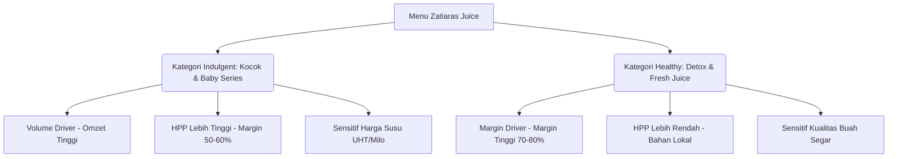

# 🍹 Panduan Riset Bisnis & Pengambilan Keputusan: Zatiaras Juice (Edisi Lengkap)

Dokumen riset ini dirancang khusus untuk pemilik (**The "Effortless Boss"**) guna mengoptimalkan operasional, menekan kebocoran keuangan/stok, dan mempercepat ekspansi bisnis **Zatiaras Juice** di tiga wilayah utama Kalimantan Timur: **Samarinda**, **Balikpapan**, dan **Berau (Tanjung Redeb)**.

---

## 📊 1. Tren Pasar & Perilaku Konsumen (2025–2026)

Tren minuman sehat di Indonesia telah bergeser dari sekadar "minuman menyegarkan" menjadi **functional wellness beverage** (minuman dengan khasiat kesehatan spesifik).

### A. Pergeseran Kategori Produk

- **Era Functional Healthy Juice:** Konsumen aktif mencari jus yang menawarkan manfaat langsung, seperti:
  - _Immune Booster_ (kombinasi jeruk, jahe, kunyit).
  - _Skin Health/Glow_ (wortel, tomat, apel - dikenal sebagai **Jus 3 Diva**).
  - _Gut Health/Detox_ (pakcoy, nanas, lemon, mentimun).
- **Artisanal & Clean Label:** Konsumen bersedia membayar lebih mahal (premium) untuk produk tanpa tambahan gula pasir (sugar-free/less sugar), tanpa bahan pengawet, dan diproses secara higienis.
- **Indulgent Shake (Kocok Series):** Kategori seperti **Alpukat Kocok** dan **Durian Kocok** tetap menjadi _volume driver_ (penyumbang volume penjualan terbesar) karena rasanya yang manis, bertekstur tebal, dan menggunakan topping populer (Milo Malaysia, keju parut).

### B. Dinamika Pasar Kalimantan Timur

- **Penyangga IKN (Ibu Kota Nusantara):** Pertumbuhan populasi pekerja kerah putih dan pendatang baru di Balikpapan dan Samarinda meningkatkan permintaan terhadap gaya hidup sehat.
- **Kerentanan Rantai Pasok:** Sebagian besar buah berkualitas tinggi di Kaltim masih dikirim dari Jawa atau Sulawesi. Pada musim kemarau atau gangguan cuaca (seperti Juni 2026), harga buah mengalami lonjakan tinggi dan stok menipis (terutama buah naga, alpukat, dan jeruk). Hal ini menuntut taktik manajemen stok yang dinamis.

---

## 🕵️ 2. Analisis Peta Kompetitor Regional

_Catatan: Peta kompetitor dan ulasan Google Maps telah dipindah secara khusus ke dokumen terpisah. Silakan baca di:_
**[ZATIARAS_COMPETITOR_REVIEW.md](file:///d:/Projects/zatiaraspos/ZATIARAS_COMPETITOR_REVIEW.md)**

---

## 🧪 3. Menu Engineering & Buku Resep HPP Lengkap

Untuk memaksimalkan profit, menu harus dibagi menjadi dua strategi besar:



### A. Lembar Kerja HPP Kocok & Baby Series (Volume Drivers)

Estimasi HPP di bawah menggunakan harga bahan grosir wilayah Kalimantan Timur per Juni 2026. Ukuran saji standar menggunakan **Cup 16oz (±470ml)**.

#### 1. Alpukat Kocok Premium (Topping Milo & Keju)

- _Alpukat Mentega Matang (130g)_: Rp7.800 (asumsi harga beli grosir Rp60.000/kg bersih)
- _Susu UHT Full Cream (100ml)_: Rp1.800
- _Susu Kental Manis Putih (35ml)_: Rp1.000
- _Topping Bubuk Milo Malaysia (15g)_: Rp1.500
- _Topping Keju Cheddar Parut (15g)_: Rp1.000
- _Packaging (Cup sablon, flat lid, straw, kantong)_: Rp1.200
- **Total HPP: Rp14.300**
- **Harga Jual Cabang: Rp30.000**
- **Margin Laba Kotor: 52.3%**

#### 2. Durian Kocok Premium

- _Daging Durian Lokal/Medan Beku (90g)_: Rp14.500 (asumsi beli bulk Rp160.000/kg)
- _Susu UHT Full Cream (100ml)_: Rp1.800
- _Susu Kental Manis Putih (30ml)_: Rp900
- _Es Batu Serut_: Rp300
- _Packaging_: Rp1.200
- **Total HPP: Rp18.700**
- **Harga Jual Cabang: Rp39.000**
- **Margin Laba Kotor: 52.1%**

#### 3. Baby Mango (Topping Whip Cream & Mango Sauce)

- _Daging Mangga Harum Manis (120g)_: Rp3.000 (asumsi musim mangga Rp25.000/kg)
- _Whip Cream Whipping (50ml)_: Rp2.500
- _Susu Kental Manis & Gula Aren (20ml)_: Rp700
- _Es Batu & Air_: Rp300
- _Sauce Mangga Hiasan_: Rp500
- _Packaging_: Rp1.200
- **Total HPP: Rp8.200**
- **Harga Jual Cabang: Rp29.000**
- **Margin Laba Kotor: 71.7%**

---

### B. Lembar Kerja HPP Healthy & Detox Series (Margin Drivers)

Menu ini tidak memerlukan produk susu/krim mahal, sehingga marginnya sangat tebal.

#### 1. Jus Pakcoy Nanas (Detox Green)

- _Pakcoy Organik Lokal (100g)_: Rp1.500 (beli dari petani lokal Rp15.000/kg)
- _Nanas Madu Kupas (150g)_: Rp1.500 (beli per buah Rp5.000, yield 300g)
- _Perasan Lemon Lokal (15ml)_: Rp800
- _Simple Syrup / Fruktosa (20ml)_: Rp400
- _Air Es & Es Batu_: Rp300
- _Packaging_: Rp1.200
- **Total HPP: Rp5.700**
- **Harga Jual Cabang: Rp22.000**
- **Margin Laba Kotor: 74.1%**

#### 2. Jus 3 Diva (Wortel, Apel, Tomat - Skin Health)

- _Wortel Lokal (80g)_: Rp1.200 (harga pasar Rp15.000/kg)
- _Apel Fuji (80g)_: Rp2.800 (harga pasar Rp35.000/kg)
- _Tomat Merah (80g)_: Rp1.200 (harga pasar Rp15.000/kg)
- _Air Es & Es Batu_: Rp300
- _Simple Syrup (15ml)_: Rp300
- _Packaging_: Rp1.200
- **Total HPP: Rp7.000**
- **Harga Jual Cabang: Rp26.000**
- **Margin Laba Kotor: 73.1%**

#### 3. Jus Kurma Pisang (Energy Booster)

- _Kurma Khalas (5 butir / ±40g)_: Rp2.000 (beli bulk Rp50.000/kg)
- _Pisang Ambon Matang (1 buah / ±100g)_: Rp1.500
- _Susu UHT Full Cream (120ml)_: Rp2.160
- _Air Es & Es Batu_: Rp300
- _Packaging_: Rp1.200
- **Total HPP: Rp7.160**
- **Harga Jual Cabang: Rp33.000**
- **Margin Laba Kotor: 78.3%**

---

### C. Persentase Yield & Susut Kupas Buah (Acuan Standar Dapur)

Gunakan tabel ini sebagai acuan pelatihan staf dapur. Angka rendemen yang rendah mengindikasikan cara mengupas staf yang salah atau kualitas buah buruk (terlalu banyak bagian busuk).

| Buah            | Berat Utuh (APQ) | Yield Bersih (EPQ) | Susut Kupas | Tindakan Pencegahan Pemborosan                                                                        |
| :-------------- | :--------------- | :----------------- | :---------- | :---------------------------------------------------------------------------------------------------- |
| **Alpukat**     | 100%             | **70%**            | 30%         | Jangan kerok bagian daging dekat kulit yang terlalu hijau/pahit. Gunakan sendok bulat tipis.          |
| **Mangga**      | 100%             | **69%**            | 31%         | Potong sedekat mungkin dengan biji. Sisa serat di biji dapat dikerok untuk saus dekorasi.             |
| **Nanas**       | 100%             | **45%**            | 55%         | Kupas mata nanas dengan pisau ukir spiral khusus. Hindari memotong daging terlalu tebal.              |
| **Wortel**      | 100%             | **85%**            | 15%         | Sikat bersih dengan air mengalir. Tidak perlu dikupas jika menggunakan juicer hidrolik komersial.     |
| **Jeruk Peras** | 100%             | **48%**            | 52%         | Gunakan alat peras tuas mekanik. Jangan diperas terlalu keras hingga kulit jeruk pecah (bikin pahit). |
| **Sirsak**      | 100%             | **55%**            | 45%         | Pisahkan biji secara manual menggunakan sarung tangan setelah buah matang empuk.                      |

---

## 🚚 4. Pemetaan Rantai Pasok Kaltim (Supplier Logistics)

### A. Sourcing Buah: Lokal vs. Impor

- **Pasokan Lokal (Kaltim):**
  - _Nanas Madu & Pepaya_: Disuplai dari Kutai Kartanegara (Kukar) dan daerah Paser.
  - _Pakcoy, Tomat, & Melon_: Diambil dari kebun hidroponik lokal di sekitar Samarinda (Lempake) dan Balikpapan (Kilo).
- **Pasokan Impor (Luar Kaltim - Surabaya/Makassar):**
  - _Alpukat Mentega & Apel_: Dikirim dari Malang/Jawa Timur via Surabaya.
  - _Durian Kupas_: Dikirim dari Medan atau Palu via kargo udara/laut berpendingin.

### B. Distribusi Laut via Pelabuhan Semayang Balikpapan

Untuk menekan biaya bahan baku hingga 30%, pembelian buah bervolume tinggi (seperti alpukat mentega dan apel fuji) sebaiknya dikirim langsung dari Surabaya menggunakan **Reefer Container (Kontainer Pendingin) FCL (Full Container Load)** 20ft:

1.  **Suhu Kargo Laut:** Diatur stabil pada suhu **5°C - 8°C** untuk menjaga buah alpukat agar tidak matang/membusuk di jalan.
2.  **Rute Logistik:** Pelabuhan Tanjung Perak (Surabaya) → Pelabuhan Semayang (Balikpapan) dengan waktu tempuh pelayaran sekitar **36 - 48 jam**.
3.  **Transit Gudang:** Setibanya di Semayang, kontainer segera dibongkar di gudang transit ber-AC Balikpapan sebelum didistribusikan menggunakan truk ekspedisi box dingin ke Samarinda (2 jam via tol) dan Berau (12-14 jam jalur darat).

### C. Daftar Rekomendasi Pasar Induk per Cabang

Untuk belanja darurat harian/mingguan jika pasokan kontainer terlambat:

- **Cabang Samarinda:** Belanja di **Pasar Segiri** (Pusat grosir sayur dan buah segar terbesar di Samarinda). Hubungi supplier tingkat pertama (agen buah) di area belakang pasar.
- **Cabang Balikpapan:** Belanja di **Pasar Pandansari** (Pusat grosir buah Balikpapan Barat). Pastikan transaksi di jam 03.00 - 05.00 WITA untuk mendapatkan barang kiriman kapal terbaru yang segar.
- **Cabang Berau:** Belanja di **Pasar Sanggam Adji Dilayas (Tanjung Redeb)**. Karena Berau paling jauh, koordinasikan dengan agen kapal agar mendapatkan buah setengah matang (mentah) sehingga tidak busuk saat tiba di lapak.

---

## 🌡️ 5. Teknik Memperpanjang Umur Simpan Jus Alami (Cold-Pressed)

Jus cold-pressed murni tanpa pengawet kimia biasanya hanya bertahan 24 jam. Gunakan taktik natural berikut untuk memperpanjang daya simpan hingga **3-5 hari di chiller**:

### A. Metode Ekstraksi Higienis

- Gunakan **Cold-Pressed Juicer (Masticating)**, bukan centrifugal blender berkecepatan tinggi. Putaran pisau blender menghasilkan panas yang merusak enzim buah dan mempercepat oksidasi (jus cepat berubah warna kecokelatan).
- Pastikan semua alat (pisau, mesin juicer, talenan) disterilisasi menggunakan air panas atau larutan sanitasi khusus food-grade sebelum operasional dimulai.

### B. Pengaturan pH Tingkat Keasaman (Natural Preservation)

- Mikroba pembusuk sulit berkembang biak pada lingkungan dengan **pH < 4.5**.
- Tambahkan **lemon juice murni (10-15ml)** atau **citric acid (asam sitrat) food-grade** sebanyak 0.1% dari volume total jus. Selain memperpanjang umur simpan, rasa jus menjadi lebih segar dan seimbang.

### C. Pencegahan Oksidasi Botol (Zero Headspace)

- Gunakan botol PET tebal atau kaca yang sudah disterilisasi.
- Isi jus hingga **penuh ke batas leher botol (zero headspace)** sebelum disegel rapat. Ketiadaan ruang udara di dalam botol menghentikan proses oksidasi enzim buah.
- Segera masukkan ke dalam **chiller bersuhu stabil 2°C - 4°C**. Perubahan suhu naik-turun akibat pintu kulkas sering dibuka akan memotong umur simpan jus secara drastis.

---

## 🔒 6. SOP Operasional Kasir & Dapur: Garansi "Anti-Bocor"

Kebocoran finansial di outlet jus sering terjadi karena hilangnya buah fisik yang diklaim "busuk" padahal dijual di luar sistem oleh kasir. Terapkan SOP wajib ini:

### SOP 1: Buka Toko (Opening Shift)

1.  **Hitung Kas Awal:** Kasir wajib menghitung uang fisik modal kembalian di laci kasir (misal: Rp300.000). Jumlah wajib diinput ke menu **Buka Sesi** di `ZatiarasPOS`.
2.  **Timbang Stok Buah Display:** Kasir dan staf dapur menimbang buah siap pakai yang dipajang di showcase (dalam satuan gram) dan mencocokkannya dengan stok akhir malam sebelumnya.

### SOP 2: Transaksi & Portion Control

1.  **Timbangan Digital di Bar:** Setiap pembuatan jus wajib menggunakan timbangan digital. Daging buah ditimbang presisi sesuai lembar resep sebelum masuk ke blender/juicer.
2.  **No Receipt, Free Juice:** Pasang stiker besar di area kasir: _"Jika kasir tidak memberikan struk cetak resmi, minuman Anda GRATIS!"_ Ini memaksa kasir menginput setiap transaksi ke sistem POS dan mencegah kasir menerima uang pelanggan tanpa menginput transaksi.
3.  **Kunci Hak Akses Void/Diskon:** Kasir dilarang memiliki wewenang menghapus item di keranjang belanja. Fitur Void transaksi wajib dikunci dengan PIN Pemilik/Manajer.

### SOP 3: Tutup Toko (Closing Shift)

1.  **Cash Count Fisik:** Di akhir shift, kasir menghitung seluruh uang tunai fisik di laci kasir.
2.  **Input Sesi Tutup:** Input jumlah uang fisik ke dalam sistem POS. Sistem akan mengeluarkan laporan selisih:
    $$\text{Selisih} = \text{Uang Fisik} - (\text{Kas Awal} + \text{Penjualan Tunai} - \text{Pengeluaran Tunai})$$
    Jika ada selisih minus, kasir wajib mengganti uang tersebut saat itu juga.
3.  **Timbang Sisa Bahan (Inventory Check):** Staf dapur menginput sisa bahan baku buah ke sistem POS untuk mencocokkan konsumsi bahan riil vs penjualan sistem.

---

## 💻 7. Implementasi SQL Laporan Laba & Audit untuk Pemilik

Karena database `ZatiarasPOS` menggunakan SQLite (Cloudflare D1 sharded), Anda dapat menjalankan query-query SQL berikut langsung pada panel admin/terminal D1 untuk memantau bisnis dari rumah:

### A. Laporan Margin Laba Kotor per Produk (Mengetahui Menu Paling Cuan)

Query ini menghitung margin keuntungan bersih dari setiap produk berdasarkan HPP yang tersimpan di sistem transaksi.

```sql
SELECT
    t.nama_produk,
    SUM(t.jumlah) AS total_terjual,
    SUM(t.nominal) AS total_omset,
    SUM(t.jumlah * COALESCE(t.nominal_hpp, 0)) AS total_hpp,
    SUM(t.nominal) - SUM(t.jumlah * COALESCE(t.nominal_hpp, 0)) AS profit_bersih,
    ROUND((SUM(t.nominal) - SUM(t.jumlah * COALESCE(t.nominal_hpp, 0))) * 100.0 / SUM(t.nominal), 2) AS margin_keuntungan_persen
FROM transaksi_kasir t
GROUP BY t.produk_id, t.nama_produk
ORDER BY profit_bersih DESC;
```

### B. Analisis Waktu Penjualan Terpadat (Peak Hours Analysis)

Gunakan laporan ini untuk mengatur jumlah staf di outlet agar hemat biaya gaji pegawai.

```sql
SELECT
    strftime('%H', waktu) AS jam_penjualan,
    COUNT(DISTINCT transaction_id) AS jumlah_transaksi,
    SUM(nominal) AS total_omset
FROM buku_kas
WHERE tipe = 'pemasukan'
GROUP BY jam_penjualan
ORDER BY total_omset DESC;
```

### C. Deteksi Kasir Nakal (Audit Sering Void Transaksi)

Kasir yang sering melakukan pembatalan transaksi berpotensi melakukan fraud (mengambil uang tunai lalu menghapus catatan transaksi).

```sql
SELECT
    dibuat_oleh AS username_staf,
    COUNT(id) AS frekuensi_void,
    SUM(delta_jumlah) AS taksiran_nilai_void_bahan,
    catatan
FROM bahan_mutasi
WHERE sumber = 'manual' AND catatan LIKE '%void%' OR catatan LIKE '%batal%'
GROUP BY dibuat_oleh
ORDER BY frekuensi_void DESC;
```

### D. Laporan Kerugian Buah Busuk / Waste Terbesar

Mengetahui jenis bahan baku apa saja yang paling banyak dibuang secara manual di dapur.

```sql
SELECT
    b.nama AS nama_bahan_baku,
    ABS(SUM(m.delta_jumlah)) AS total_stok_dibuang,
    b.satuan,
    SUM(ABS(m.delta_jumlah) * b.biaya_per_satuan) AS taksiran_kerugian_rupiah
FROM bahan_mutasi m
JOIN bahan b ON m.bahan_id = b.id
WHERE m.delta_jumlah < 0 AND m.sumber = 'manual' AND (m.catatan LIKE '%busuk%' OR m.catatan LIKE '%waste%' OR m.catatan LIKE '%rusak%')
GROUP BY b.nama, b.satuan
ORDER BY taksiran_kerugian_rupiah DESC;
```

---

## 📈 8. Strategi Ekspansi & Skalabilitas Bisnis (Growth Hacking)

Untuk mengembangkan skala bisnis Zatiaras Juice dari status UMKM lokal menjadi merek regional terkemuka di Kalimantan Timur, berikut adalah beberapa strategi inovasi model bisnis yang dapat diterapkan:

### A. Model Langganan Jus Sehat Harian (Daily Juice Subscription)

Meniru model sukses Naked Press dan Homjuice di Jakarta, Zatiaras dapat menawarkan program berlangganan untuk konsumen kantor dan pecinta kebugaran (gym) di Samarinda dan Balikpapan:

1.  **Paket 5-Day Detox Challenge:** Paket berisi 5-10 botol jus cold-pressed dikirim setiap pagi ke kantor atau rumah pelanggan dari hari Senin sampai Jumat.
2.  **Sistem Pembayaran Berulang (Predictable Revenue):** Pelanggan membayar di muka untuk 1 bulan (diskon 15-20% dibanding harga eceran). Hal ini memberikan keuntungan cash flow yang sehat bagi bisnis dan membantu memproyeksikan pembelian buah mingguan secara presisi sehingga menekan risiko buah busuk.
3.  **Pengiriman Terjadwal:** Distribusi dilakukan pagi hari pukul 07.00 - 08.30 WITA menggunakan tas pendingin khusus (_cooler bag_) agar jus tiba dalam kondisi sangat segar untuk sarapan.

### B. Kemitraan Kios Mikro (Micro-Franchise)

Ekspansi gerai fisik dengan modal minimal menggunakan sistem kemitraan berbasis kios/booth portabel:

1.  **Sentralisasi Bahan Baku (Central Kitchen):** Untuk menjaga konsistensi rasa antar-mitra (misalnya cabang Samarinda, Balikpapan, dan Berau) dan mencegah kecurangan inventaris:
    - Buah dikupas, dipotong, ditakar per porsi (misal 150g), dimasukkan ke kantong plastik vakum steril, kemudian **dibekukan (Frozen IQF)** di dapur pusat Zatiaras.
    - Mitra franchise hanya perlu memesan "paket porsi buah beku" dari dapur pusat. Saat membuat jus, mereka cukup merobek 1 kantong buah beku tanpa perlu menimbang atau mengupas lagi. Ini menghilangkan susut kupas di tingkat gerai dan mencegah kasir berbuat curang dengan porsi.
2.  **Branding & Sistem Kasir Terpadu:** Setiap mitra wajib menggunakan aplikasi `ZatiarasPOS` agar pemilik dapat memantau penjualan real-time di semua cabang waralaba dari satu dasbor.

### C. Premiumisasi Menu dengan Booster Kebugaran (Add-ons Up-selling)

Meningkatkan nilai rata-rata transaksi (_Average Transaction Value_) per pelanggan dengan menawarkan suplemen tambahan ber-HPP rendah namun bernilai tinggi:

- **Booster Shot (50ml):** Jus jahe murni, kunyit, lemon pekat untuk _immune shot_ cepat. HPP rendah (Rp2.000), harga jual tinggi (Rp10.000).
- **Superfood Add-ons:** Tawarkan pilihan untuk menambahkan 1 sendok teh Chia Seeds (+Rp3.000), Whey Protein (+Rp8.000 untuk pelanggan gym), atau Madu Hutan Asli (+Rp5.000) langsung ke jus blender mereka.

### D. Pemasaran Komunitas Olahraga Lokal (Hyperlocal Community Marketing)

- **Partnership Komunitas Lari & Sepeda:** Gandeng komunitas olahraga yang sedang tren di Samarinda dan Balikpapan (misal: Samarinda Runners, Balikpapan Road Bike). Tawarkan diskon 15% bagi anggota komunitas yang datang ke gerai setelah berolahraga pagi atau pasang booth kecil di titik kumpul mereka.
- **Car Free Day (CFD) Pop-up:** Hadir secara berkala di CFD Samarinda (Jl. Kesuma Bangsa) atau CFD Balikpapan (Lapangan Merdeka) dengan membawa varian jus botolan siap minum. Ini adalah cara termudah dan termurah untuk memperkenalkan merek Zatiaras Juice ke ratusan calon pelanggan baru setiap minggu.

### E. Program Loyalitas Botol Kembali (Green Loop Loyalty)

Membangun kesadaran lingkungan sekaligus mengunci loyalitas pelanggan:

- Berikan insentif berupa potongan harga Rp1.000 untuk setiap botol plastik kosong Zatiaras Juice yang dikembalikan oleh pelanggan ke gerai cabang, atau _"Kembalikan 10 botol kosong, dapatkan 1 jus gratis"_.
- Strategi ini menghemat biaya pembelian kemasan botol baru (penghematan HPP) sekaligus menarik perhatian segmen konsumen modern yang peduli kelestarian lingkungan.
