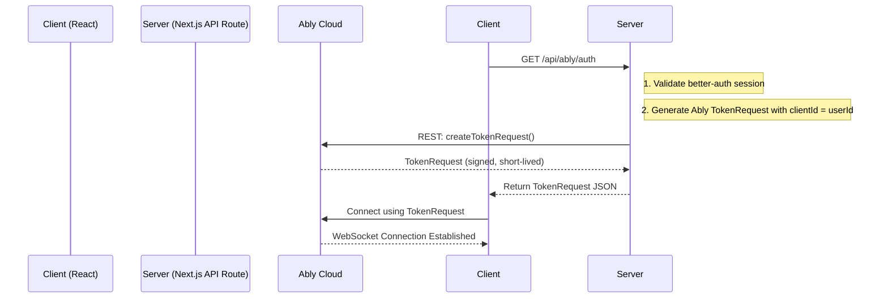

# **Plan: Ably Realtime Integration for Expeditoo**

**Version:** 1.0.0
**Created:** 2025-12-12
**Status:** ✅ COMPLETED
**Last Updated:** 2025-12-13

---

## **1. Executive Summary**

This document outlines the implemented Ably Realtime architecture for Expeditoo. The system successfully replaces short polling with event-driven Ably subscriptions, providing:

- **Instant updates** (0ms delay).
- **Reduced server load** (No constant HTTP requests).
- **Better UX** (True real-time experience for chat, auctions, notifications).

---

## **2. Scope of Work**

### **2.1 Features to Migrate**

| Feature                                       | Current Polling | Target Ably Events            | Priority   |
| --------------------------------------------- | --------------- | ----------------------------- | ---------- |
| Chat Messages (`useMessageDetail.ts`)         | 2s              | `message:new`, `message:read` | **High**   |
| Chat Inbox (`useMessages.ts`)                 | 2s              | `conversation:update`         | **High**   |
| Unread Message Count (`useUnreadMessages.ts`) | 8s              | `badge:messages`              | **High**   |
| Notifications (`useNotifications.ts`)         | 8s              | `notification:new`            | **High**   |
| Auction Bidding (`useAuctionDetail.ts`)       | 10s             | `bid:new`, `auction:ended`    | **Medium** |
| My Bids Status (`useMyBids.ts`)               | 30s             | `bid:outbid`, `bid:won`       | **Medium** |
| Order/Checkout Status (`useWonCheckout.ts`)   | 10s             | `order:status`                | **Low**    |
| Admin Analytics (`useAdminAnalytics.ts`)      | 60s             | (Keep polling or no realtime) | **Low**    |

### **2.2 Out of Scope**

- Presence/Online Status (Deferred to future).
- Typing Indicators (Out of scope per roadmap).
- Admin Analytics realtime (Keep polling; data volume is low, and instant updates are not critical).

---

## **3. Technical Architecture**

### **3.1 Channel Naming Convention**

We will use a **namespace-based naming convention** for channels to organize events logically and enable capability-based access control.

| Channel Pattern                 | Purpose                       | Example                     |
| ------------------------------- | ----------------------------- | --------------------------- |
| `user:{userId}:notifications`   | Private user notifications    | `user:abc123:notifications` |
| `user:{userId}:messages`        | Private message badge updates | `user:abc123:messages`      |
| `conversation:{conversationId}` | Private 1-on-1 chat room      | `conversation:xyz789`       |
| `listing:{listingId}:bids`      | Public auction bid updates    | `listing:prod001:bids`      |
| `order:{orderId}:status`        | Private order status updates  | `order:ord555:status`       |

### **3.2 Authentication Flow (Token Auth)**



**Why Token Auth?**

- API Key is NEVER exposed to the client.
- `clientId` is set server-side, ensuring user identity cannot be spoofed.
- Ably SDK handles automatic token refresh seamlessly.

### **3.3 Event Publishing Strategy (Server-Side)**

All events will be **published from the backend service layer**, NOT from the client. This ensures:

1. Data integrity (events are only fired after successful DB operations).
2. Security (clients can't fake events).

**Example:** When a message is sent:

```
messagesService.sendMessage()
  -> DAL.createMessage() // Save to DB
  -> Ably.channel.publish('message:new', payload) // Notify recipients
```

### **3.4 Type Safety (Zod Validation for Events)**

Per `docs/rules.md`, all I/O must be validated with **Zod**. This applies to Ably event payloads as well.

**Server-Side (Publishing):**

- Before publishing, validate the payload against the event schema.
- Ensures malformed data never enters the real-time pipeline.

**Client-Side (Receiving):**

- When a hook receives an Ably event, parse the payload with Zod before updating cache.
- If validation fails, log error and ignore the event (fail-safe).

**Event Schemas Location:** `src/server/dto/ably-events.dto.ts`

**Example Schema:**

```typescript
import { z } from "zod";

export const newMessageEventSchema = z.object({
  id: z.string(),
  conversationId: z.string(),
  senderId: z.string(),
  content: z.string(),
  createdAt: z.string(),
  isOwn: z.boolean(),
});

export type NewMessageEvent = z.infer<typeof newMessageEventSchema>;

export const newBidEventSchema = z.object({
  bidId: z.string(),
  listingId: z.string(),
  bidderId: z.string(),
  amount: z.number(),
  createdAt: z.string(),
});

export type NewBidEvent = z.infer<typeof newBidEventSchema>;

export const notificationEventSchema = z.object({
  id: z.string(),
  type: z.string(),
  title: z.string(),
  message: z.string(),
  createdAt: z.string(),
  data: z.record(z.unknown()).optional(),
});

export type NotificationEvent = z.infer<typeof notificationEventSchema>;
```

---

## **4. Implementation Tasks**

### **Phase 1: Foundation (Infrastructure)**

| #   | Task                                   | Files to Create/Modify                      | Complexity |
| --- | -------------------------------------- | ------------------------------------------- | ---------- |
| 1.1 | Install Ably dependency                | `package.json`                              | Low        |
| 1.2 | Add `ABLY_API_KEY` to environment      | `.env`, `.env.example`, Vercel              | Low        |
| 1.3 | Create server-side Ably REST client    | `src/lib/ably-server.ts`                    | Low        |
| 1.4 | Create API route for Token Auth        | `src/app/api/ably/auth/route.ts`            | Medium     |
| 1.5 | Create AblyProvider (React Context)    | `src/components/providers/AblyProvider.tsx` | Medium     |
| 1.6 | Integrate AblyProvider in root layout  | `src/components/providers/Providers.tsx`    | Low        |
| 1.7 | **Create Ably Event DTOs (Zod)**       | `src/server/dto/ably-events.dto.ts`         | Medium     |
| 1.8 | Register Ably auth endpoint in OpenAPI | `src/server/openapi/registry.ts`            | Low        |
| 1.9 | Update API documentation               | `docs/api.md`                               | Low        |

### **Phase 2: Chat Migration**

| #   | Task                                                              | Files to Modify                                        | Complexity |
| --- | ----------------------------------------------------------------- | ------------------------------------------------------ | ---------- |
| 2.1 | Create `useAblyChannel` wrapper hook                              | `src/lib/hooks/useAblyChannel.ts`                      | Medium     |
| 2.2 | Refactor `useMessageDetail.ts`                                    | `src/features/app/messages/hooks/useMessageDetail.ts`  | High       |
|     | - Keep `useQuery` for initial history fetch                       |                                                        |            |
|     | - Remove `refetchInterval: 2000`                                  |                                                        |            |
|     | - Add `useChannel` subscription for `message:new` event           |                                                        |            |
|     | - On event -> `queryClient.setQueryData` to insert new message    |                                                        |            |
| 2.3 | Refactor `useMessages.ts`                                         | `src/features/app/messages/hooks/useMessages.ts`       | Medium     |
|     | - Remove `refetchInterval: 2000`                                  |                                                        |            |
|     | - Subscribe to `user:{userId}:messages` for inbox updates         |                                                        |            |
|     | - On event -> invalidate `["messages", "conversations"]` query    |                                                        |            |
| 2.4 | Refactor `useUnreadMessages.ts`                                   | `src/features/app/messages/hooks/useUnreadMessages.ts` | Low        |
|     | - Remove `refetchInterval: 8000`                                  |                                                        |            |
|     | - Subscribe to `user:{userId}:messages` for badge updates         |                                                        |            |
| 2.5 | Publish event on message send (Backend)                           | `src/server/services/messages.service.ts`              | Medium     |
|     | - After `DAL.createMessage()`, call `ablyServer.publish()`        |                                                        |            |
|     | - Publish to `conversation:{id}` channel with `message:new` event |                                                        |            |
|     | - Publish to `user:{recipientId}:messages` for badge update       |                                                        |            |

### **Phase 3: Notifications Migration**

| #   | Task                                                            | Files to Modify                                            | Complexity |
| --- | --------------------------------------------------------------- | ---------------------------------------------------------- | ---------- |
| 3.1 | Refactor `useNotifications.ts`                                  | `src/features/app/notifications/hooks/useNotifications.ts` | Medium     |
|     | - Remove `refetchInterval: 8000`                                |                                                            |            |
|     | - Subscribe to `user:{userId}:notifications`                    |                                                            |            |
|     | - On event -> Optimistically add to list OR invalidate query    |                                                            |            |
| 3.2 | Publish notification events (Backend)                           | `src/server/services/notifications.service.ts`             | Medium     |
|     | - After `DAL.createNotification()`, call `ablyServer.publish()` |                                                            |            |
|     | - Publish to `user:{recipientId}:notifications` channel         |                                                            |            |

### **Phase 4: Auction Bidding Migration**

| #   | Task                                                            | Files to Modify                                      | Complexity |
| --- | --------------------------------------------------------------- | ---------------------------------------------------- | ---------- |
| 4.1 | Refactor `useAuctionDetail.ts`                                  | `src/features/app/auction/hooks/useAuctionDetail.ts` | Medium     |
|     | - Remove `refetchInterval: 10000`                               |                                                      |            |
|     | - Subscribe to `listing:{listingId}:bids`                       |                                                      |            |
|     | - On `bid:new` event -> Update currentBid in cache              |                                                      |            |
|     | - On `auction:ended` event -> Show "Auction Ended" state        |                                                      |            |
| 4.2 | Refactor `useMyBids.ts`                                         | `src/features/app/auction/hooks/useMyBids.ts`        | Low        |
|     | - Remove `refetchInterval: 30000`                               |                                                      |            |
|     | - Subscribe to `user:{userId}:bids` for outbid/won events       |                                                      |            |
| 4.3 | Publish bid events (Backend)                                    | `src/server/services/bids.service.ts`                | Medium     |
|     | - After `DAL.createBid()`:                                      |                                                      |            |
|     | - Publish `bid:new` to `listing:{listingId}:bids`               |                                                      |            |
|     | - Publish `bid:outbid` to `user:{previousHighestBidderId}:bids` |                                                      |            |

### **Phase 5: Order Status & Cleanup**

| #   | Task                                    | Files to Modify                                     | Complexity |
| --- | --------------------------------------- | --------------------------------------------------- | ---------- |
| 5.1 | Refactor `useWonCheckout.ts`            | `src/features/app/checkout/hooks/useWonCheckout.ts` | Low        |
|     | - Remove `refetchInterval: 10000`       |                                                     |            |
|     | - Subscribe to `order:{orderId}:status` |                                                     |            |
| 5.2 | Publish order status events (Backend)   | `src/server/services/orders.service.ts`             | Medium     |
| 5.3 | Keep `useAdminAnalytics.ts` as polling  | (No change)                                         | None       |
| 5.4 | Documentation update                    | `docs/overview.md`, `docs/roadmap.md`               | Low        |
| 5.5 | Remove PUSHER_GUIDE.md (if exists)      | Root folder cleanup                                 | Low        |

---

## **5. Code Snippets (For Reference)**

### **5.1 Server-Side Ably Client (`src/lib/ably-server.ts`)**

```typescript
import Ably from "ably";

// Singleton instance for server-side publishing
let ablyRestClient: Ably.Rest | null = null;

function getAblyRestClient() {
  if (!ablyRestClient) {
    ablyRestClient = new Ably.Rest(process.env.ABLY_API_KEY!);
  }
  return ablyRestClient;
}

export const ablyServer = {
  /**
   * Publish an event to a channel
   */
  async publish(channelName: string, eventName: string, data: unknown) {
    const client = getAblyRestClient();
    const channel = client.channels.get(channelName);
    await channel.publish(eventName, data);
  },
};
```

### **5.2 Token Auth API Route (`src/app/api/ably/auth/route.ts`)**

```typescript
import Ably from "ably";
import { NextRequest, NextResponse } from "next/server";
import { auth } from "@/lib/auth"; // Your better-auth instance

export async function GET(request: NextRequest) {
  try {
    // 1. Get authenticated user
    const session = await auth.api.getSession({ headers: request.headers });
    if (!session?.user) {
      return NextResponse.json(
        {
          success: false,
          error: {
            code: "UNAUTHORIZED",
            message: "Authentication required to access real-time features",
          },
        },
        { status: 401 }
      );
    }

    // 2. Create Ably REST client
    const client = new Ably.Rest(process.env.ABLY_API_KEY!);

    // 3. Create TokenRequest with user's ID as clientId
    const tokenRequestData = await client.auth.createTokenRequest({
      clientId: session.user.id,
      // Optional: Define capabilities to restrict access
      // capability: { 'user:*': ['subscribe'] }
    });

    // 4. Return standard success response
    return NextResponse.json({
      success: true,
      data: tokenRequestData,
    });
  } catch (error) {
    console.error("Ably auth error:", error);
    return NextResponse.json(
      {
        success: false,
        error: {
          code: "ABLY_AUTH_ERROR",
          message: "Failed to generate real-time authentication token",
        },
      },
      { status: 500 }
    );
  }
}
```

### **5.3 AblyProvider (`src/components/providers/AblyProvider.tsx`)**

```typescript
'use client';

import * as Ably from 'ably';
import { AblyProvider as AblyReactProvider } from 'ably/react';
import { useMemo } from 'react';
import { useSession } from '@/lib/auth-client'; // Your auth client

export function AblyProvider({ children }: { children: React.ReactNode }) {
  const { data: session } = useSession();

  // Only create client when user is logged in
  // Uses custom authCallback to handle standard API response format
  const client = useMemo(() => {
    if (!session?.user) return null;
    return new Ably.Realtime({
      authCallback: async (tokenParams, callback) => {
        try {
          const response = await fetch('/api/ably/auth');
          const result = await response.json();

          if (!result.success) {
            callback(new Error(result.error?.message || 'Auth failed'), null);
            return;
          }

          callback(null, result.data);
        } catch (error) {
          callback(error as Error, null);
        }
      },
    });
  }, [session?.user]);

  // If not logged in, render children without Ably context
  if (!client) {
    return <>{children}</>;
  }

  return (
    <AblyReactProvider client={client}>
      {children}
    </AblyReactProvider>
  );
}
```

### **5.4 Refactored `useMessageDetail.ts` (With Zod Validation)**

```typescript
import { useChannel } from "ably/react";
import { useQuery, useQueryClient } from "@tanstack/react-query";
import {
  newMessageEventSchema,
  type NewMessageEvent,
} from "@/server/dto/ably-events.dto";
// ... existing imports

export function useMessageDetail(conversationId: string) {
  const queryClient = useQueryClient();

  // 1. Initial data fetch (keep useQuery, but REMOVE refetchInterval)
  const { data: threadData, isLoading } = useQuery({
    queryKey: ["messages", "thread", conversationId],
    queryFn: () => messagesApi.getThread(conversationId),
    enabled: !!conversationId,
    // refetchInterval: 2000, // <-- REMOVED
    staleTime: Infinity, // Data is fresh until Ably tells us otherwise
  });

  // 2. Subscribe to real-time updates WITH ZOD VALIDATION
  useChannel(`conversation:${conversationId}`, "message:new", (ablyMessage) => {
    // Validate payload with Zod before using
    const parsed = newMessageEventSchema.safeParse(ablyMessage.data);

    if (!parsed.success) {
      console.error(
        "[Ably] Invalid message:new payload",
        parsed.error.flatten()
      );
      return; // Fail-safe: ignore invalid events
    }

    const newMessage: NewMessageEvent = parsed.data;

    // Optimistically add validated message to query cache
    queryClient.setQueryData(
      ["messages", "thread", conversationId],
      (old: ThreadResponse | undefined) => {
        if (!old) return old;
        return {
          ...old,
          messages: [...old.messages, newMessage],
        };
      }
    );
  });

  // ... rest of hook logic (send mutation, etc.)
}
```

---

## **6. Testing Strategy**

| Test Case              | How to Verify                                                                        |
| ---------------------- | ------------------------------------------------------------------------------------ |
| Token Auth works       | Login -> Open DevTools Network -> Verify `/api/ably/auth` returns TokenRequest       |
| Connection established | Add `useConnectionStateListener` component -> Verify "connected" state               |
| Chat message instant   | Open 2 browsers as User A & B -> A sends message -> B receives within 1s             |
| Notification instant   | Trigger backend action (e.g., bid on auction) -> Notification appears instantly      |
| Reconnection           | Disconnect wifi briefly -> Reconnect -> Verify messages are synced via history       |
| Polling fully removed  | Search codebase for `refetchInterval` -> Should only exist in `useAdminAnalytics.ts` |

---

## **7. Rollback Plan**

If issues arise during or after deployment:

1. **Environment Variable:** Set `NEXT_PUBLIC_REALTIME_ENABLED=false`.
2. **Conditional Logic:** Add feature flag in hooks to fall back to polling if flag is false.
3. **Quick Revert:** Hooks can easily revert to `refetchInterval` pattern by uncommenting old code.

---

## **8. Estimated Effort**

| Phase                    | Estimated Time   |
| ------------------------ | ---------------- |
| Phase 1: Foundation      | 2-3 hours        |
| Phase 2: Chat Migration  | 4-6 hours        |
| Phase 3: Notifications   | 2-3 hours        |
| Phase 4: Auction         | 3-4 hours        |
| Phase 5: Order & Cleanup | 1-2 hours        |
| **Total**                | **~12-18 hours** |

---

## **9. Definition of Done**

- [ ] All polling hooks (except Admin Analytics) have `refetchInterval` removed.
- [ ] All features receive real-time updates via Ably events.
- [ ] Token Auth is secure (API key not exposed, clientId server-enforced).
- [ ] **Ably Event DTOs created with Zod schemas (`ably-events.dto.ts`).**
- [ ] **All client-side event handlers validate payloads with Zod before use.**
- [ ] Documentation updated (`overview.md`, `roadmap.md`).
- [ ] Manual testing passed for Chat, Notifications, Auction Bidding.
- [ ] Production deployment successful with no errors in Ably dashboard.

---

## **10. Appendix: Environment Variables**

Add to `.env.local` (development) and Vercel (production):

```env
# Ably Realtime
ABLY_API_KEY=YOUR_ABLY_API_KEY_HERE
```

**Getting API Key:**

1. Go to [ably.com](https://ably.com) and sign up (free).
2. Create a new App (e.g., "Expeditoo").
3. Go to "API Keys" tab.
4. Copy the "Root Key" (format: `appId.keyName:keySecret`).

---

**End of Plan**
